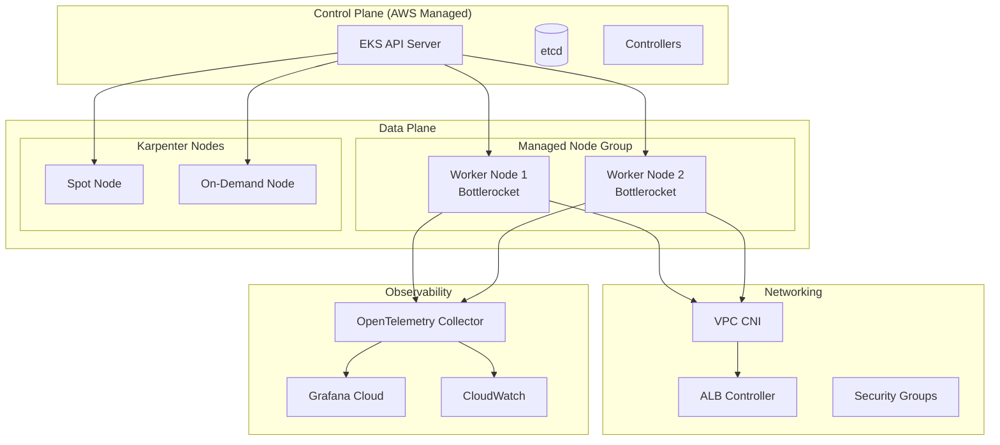
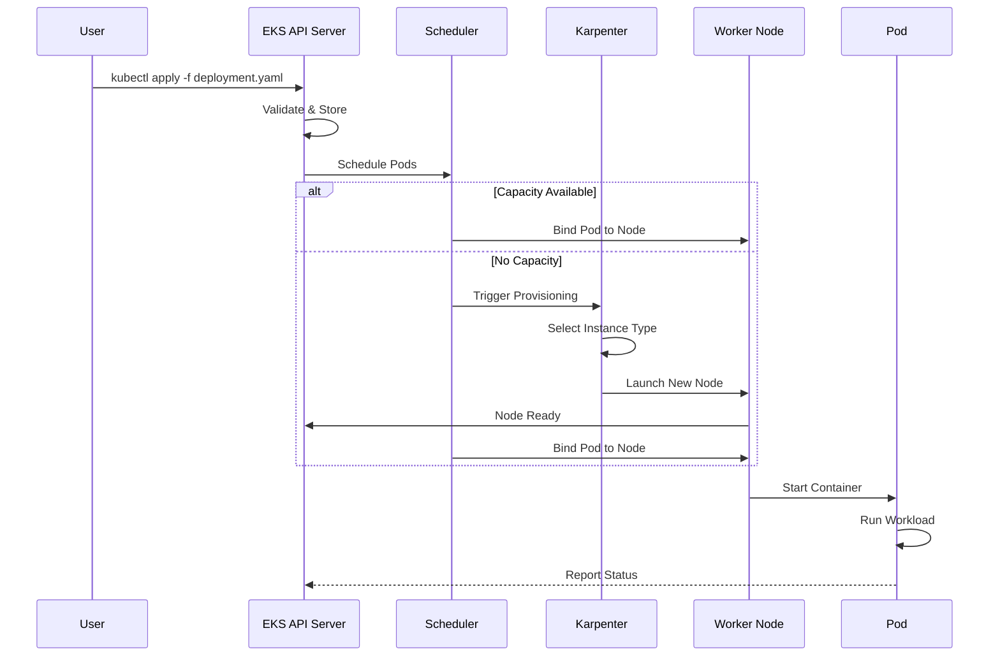
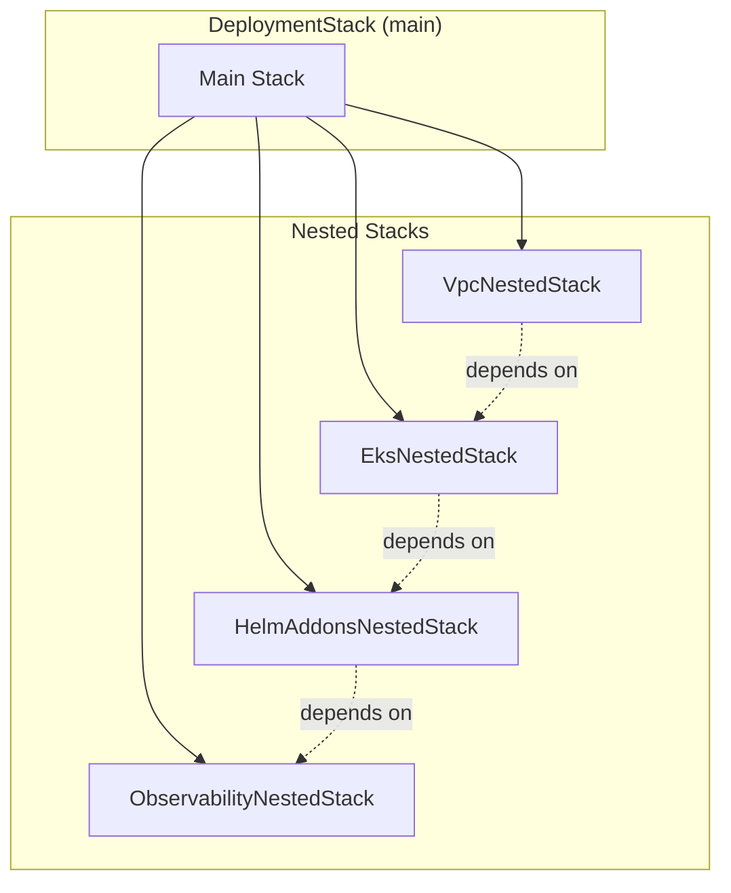

# aws-eks-infra

<div align="center">

*AWS CDK application written in Java that provisions an Amazon EKS (Elastic Kubernetes Service) cluster with managed addons, custom Helm charts, observability integration, and node groups for production Kubernetes workloads.*

[](https://opensource.org/licenses/MIT)
[](https://www.oracle.com/java/)
[](https://aws.amazon.com/cdk/)
[](https://aws.amazon.com/vpc/)
[](https://aws.amazon.com/eks/)
[](https://kubernetes.io/)
[](https://opentelemetry.io/)
[](https://grafana.com/)

</div>

---

## Overview

This CDK application provisions a production-ready [Amazon EKS](https://docs.aws.amazon.com/eks/latest/userguide/what-is-eks.html) cluster with enterprise-grade features for running containerized workloads. The infrastructure integrates with the Fastish platform services for automated deployment and observability. The architecture follows [EKS Best Practices Guide](https://aws.github.io/aws-eks-best-practices/) recommendations.

### Key Features

| Feature | Description | Reference |
|---------|-------------|-----------|
| **EKS Cluster** | Managed Kubernetes control plane with RBAC configuration | [EKS User Guide](https://docs.aws.amazon.com/eks/latest/userguide/getting-started.html) |
| **AWS Managed Addons** | VPC CNI, EBS CSI, CoreDNS, Kube Proxy, Pod Identity Agent, CloudWatch Container Insights | [EKS Add-ons](https://docs.aws.amazon.com/eks/latest/userguide/eks-add-ons.html) |
| **Helm Chart Addons** | cert-manager, AWS Load Balancer Controller, Karpenter, CSI Secrets Store | [Helm](https://helm.sh/) |
| **Grafana Cloud Integration** | Full observability stack with metrics, logs, and traces | [Grafana Cloud](https://grafana.com/products/cloud/) |
| **Managed Node Groups** | Bottlerocket AMIs for enhanced security | [Managed Node Groups](https://docs.aws.amazon.com/eks/latest/userguide/managed-node-groups.html) |
| **Node Interruption Handling** | SQS queue for graceful node termination | [Karpenter Interruption](https://karpenter.sh/docs/concepts/disruption/) |

---

## Architecture

### System Overview



### Pod Deployment Flow



### Stack Structure

The EKS infrastructure uses a layered architecture with [CloudFormation nested stacks](https://docs.aws.amazon.com/AWSCloudFormation/latest/UserGuide/using-cfn-nested-stacks.html):



**Dependency Chain**:

1. VPC is created first (network foundation)
2. EKS cluster is provisioned with managed addons
3. Helm addons are deployed after cluster is ready
4. Observability stack configures telemetry collection

### AWS Managed EKS Addons

| Addon | Purpose | Reference |
|-------|---------|-----------|
| **[VPC CNI](https://docs.aws.amazon.com/eks/latest/userguide/managing-vpc-cni.html)** | Native AWS networking for pods with VPC IP addresses | [amazon-vpc-cni-k8s](https://github.com/aws/amazon-vpc-cni-k8s) |
| **[EBS CSI Driver](https://docs.aws.amazon.com/eks/latest/userguide/ebs-csi.html)** | Persistent volume support using Amazon EBS | [aws-ebs-csi-driver](https://github.com/kubernetes-sigs/aws-ebs-csi-driver) |
| **[CoreDNS](https://docs.aws.amazon.com/eks/latest/userguide/managing-coredns.html)** | Cluster DNS for Kubernetes service discovery | [CoreDNS](https://coredns.io/) |
| **[Kube Proxy](https://docs.aws.amazon.com/eks/latest/userguide/managing-kube-proxy.html)** | Network proxy for Kubernetes Services | [kube-proxy](https://kubernetes.io/docs/reference/command-line-tools-reference/kube-proxy/) |
| **[Pod Identity Agent](https://docs.aws.amazon.com/eks/latest/userguide/pod-identities.html)** | IAM roles for Kubernetes service accounts | [EKS Pod Identity](https://docs.aws.amazon.com/eks/latest/userguide/pod-id-how-it-works.html) |
| **[CloudWatch Container Insights](https://docs.aws.amazon.com/AmazonCloudWatch/latest/monitoring/Container-Insights-EKS.html)** | Container metrics and logs collection | [Container Insights](https://docs.aws.amazon.com/AmazonCloudWatch/latest/monitoring/ContainerInsights.html) |

### Helm Chart Addons

| Addon | Purpose | Reference |
|-------|---------|-----------|
| **[cert-manager](https://cert-manager.io/)** | Automated TLS certificate management | [cert-manager Docs](https://cert-manager.io/docs/) |
| **[AWS Load Balancer Controller](https://kubernetes-sigs.github.io/aws-load-balancer-controller/)** | ALB/NLB provisioning for Kubernetes Services | [AWS LB Controller](https://docs.aws.amazon.com/eks/latest/userguide/aws-load-balancer-controller.html) |
| **[Karpenter](https://karpenter.sh/)** | Just-in-time node provisioning and autoscaling | [Karpenter Docs](https://karpenter.sh/docs/) |
| **[CSI Secrets Store](https://secrets-store-csi-driver.sigs.k8s.io/)** | Mount secrets from external stores | [Secrets Store CSI Driver](https://docs.aws.amazon.com/secretsmanager/latest/userguide/integrating_csi_driver.html) |

### Observability Stack

The cluster integrates with [Grafana Cloud](https://grafana.com/products/cloud/) for comprehensive observability:

| Component | Purpose | Reference |
|-----------|---------|-----------|
| **Prometheus** | Metrics collection and storage | [Grafana Mimir](https://grafana.com/oss/mimir/) |
| **Loki** | Log aggregation and querying | [Grafana Loki](https://grafana.com/oss/loki/) |
| **Tempo** | Distributed tracing | [Grafana Tempo](https://grafana.com/oss/tempo/) |
| **Pyroscope** | Continuous profiling | [Grafana Pyroscope](https://grafana.com/oss/pyroscope/) |
| **OpenTelemetry Collector** | Telemetry data collection and export | [OpenTelemetry](https://opentelemetry.io/) |

### Platform Integration

When deployed through the Fastish platform, this infrastructure integrates with internal platform services:

| Platform Component | Integration Point | Purpose |
|--------------------|-------------------|---------|
| **Orchestrator** | Release pipeline automation | Automated CDK synthesis and deployment via CodePipeline |
| **Portal** | Subscriber management | Tenant provisioning, cluster access control |
| **Network** | Shared VPC infrastructure | Cross-stack connectivity for platform services |
| **Reporting** | Usage metering | Pipeline execution tracking and cost attribution |

These integrations are managed automatically when deploying via the platform's release workflows.

---

## Prerequisites

| Requirement | Version | Installation |
|-------------|---------|--------------|
| **Java** | 21+ | [SDKMAN](https://sdkman.io/) |
| **Maven** | 3.8+ | [Maven Download](https://maven.apache.org/download.cgi) |
| **AWS CLI** | 2.x | [AWS CLI Install](https://docs.aws.amazon.com/cli/latest/userguide/getting-started-install.html) |
| **AWS CDK CLI** | 2.221.0+ | [CDK Getting Started](https://docs.aws.amazon.com/cdk/v2/guide/getting-started.html) |
| **kubectl** | 1.28+ | [kubectl Install](https://kubernetes.io/docs/tasks/tools/) |
| **Helm** | 3.x | [Helm Install](https://helm.sh/docs/intro/install/) |
| **GitHub CLI** | Latest | [GitHub CLI](https://cli.github.com/) |

**AWS CDK Bootstrap**:

```bash
cdk bootstrap aws://<account-id>/<region>
```

> Replace `<account-id>` with your AWS account ID and `<region>` with your desired AWS region (e.g., `us-west-2`).
> This sets up necessary resources for CDK deployments including an S3 bucket for assets and CloudFormation execution roles.
> See: [CDK Bootstrapping](https://docs.aws.amazon.com/cdk/v2/guide/bootstrapping.html) | [Bootstrap CLI Reference](https://docs.aws.amazon.com/cdk/v2/guide/ref-cli-cmd-bootstrap.html)

---

## Deployment

### Step 1: Clone Repositories

```bash
gh repo clone fast-ish/cdk-common
gh repo clone fast-ish/aws-eks-infra
```

### Step 2: Build Projects

```bash
mvn -f cdk-common/pom.xml clean install
mvn -f aws-eks-infra/pom.xml clean install
```

### Step 3: Configure Deployment

Create `aws-eks-infra/cdk.context.json` from `aws-eks-infra/cdk.context.template.json`:

**Required Configuration Parameters**:

| Parameter | Description | Example |
|-----------|-------------|---------|
| `:account` | AWS account ID (12-digit number) | `123456789012` |
| `:region` | AWS region for deployment | `us-west-2` |
| `:domain` | Registered domain name (optional for SES) | `example.com` |
| `:environment` | Environment name (do not change) | `prototype` |
| `:version` | Resource version identifier | `v1` |

**Notes**:
- `:environment` and `:version` map to resource files at `aws-eks-infra/src/main/resources/prototype/v1`
- These values determine which configuration templates are loaded during CDK synthesis

### Step 4: Configure Cluster Access

Add IAM role mappings in `cdk.context.json` for [EKS access entries](https://docs.aws.amazon.com/eks/latest/userguide/access-entries.html):

```json
{
  "deployment:eks:administrators": [
    {
      "username": "administrator",
      "role": "arn:aws:iam::000000000000:role/AWSReservedSSO_AdministratorAccess_abc",
      "email": "admin@example.com"
    }
  ],
  "deployment:eks:users": [
    {
      "username": "user",
      "role": "arn:aws:iam::000000000000:role/AWSReservedSSO_DeveloperAccess_abc",
      "email": "user@example.com"
    }
  ]
}
```

| Parameter | Description | Reference |
|-----------|-------------|-----------|
| `administrators` | IAM roles with full cluster admin access | [Cluster Admin](https://docs.aws.amazon.com/eks/latest/userguide/grant-k8s-access.html) |
| `users` | IAM roles with read-only cluster access | [RBAC Authorization](https://kubernetes.io/docs/reference/access-authn-authz/rbac/) |
| `username` | Identifier for the user in Kubernetes RBAC | [User Mapping](https://docs.aws.amazon.com/eks/latest/userguide/add-user-role.html) |
| `role` | AWS IAM role ARN (typically from [AWS IAM Identity Center](https://docs.aws.amazon.com/singlesignon/latest/userguide/what-is.html)) | [IAM Roles](https://docs.aws.amazon.com/IAM/latest/UserGuide/id_roles.html) |
| `email` | For identification and traceability | - |

### Step 5: Configure Grafana Cloud (Optional)

For observability integration, add Grafana Cloud configuration:

```json
{
  "hosted:eks:grafana:instanceId": "000000",
  "hosted:eks:grafana:key": "glc_xyz",
  "hosted:eks:grafana:lokiHost": "https://logs-prod-000.grafana.net",
  "hosted:eks:grafana:lokiUsername": "000000",
  "hosted:eks:grafana:prometheusHost": "https://prometheus-prod-000-prod-us-west-0.grafana.net",
  "hosted:eks:grafana:prometheusUsername": "0000000",
  "hosted:eks:grafana:tempoHost": "https://tempo-prod-000-prod-us-west-0.grafana.net/tempo",
  "hosted:eks:grafana:tempoUsername": "000000",
  "hosted:eks:grafana:pyroscopeHost": "https://profiles-prod-000.grafana.net:443"
}
```

**Grafana Cloud Setup**:

1. **Create Account**: Sign up at [grafana.com](https://grafana.com/)
2. **Create Stack**: Navigate to your stack settings
3. **Generate API Key**: Create key with required permissions

| Parameter | Location | Description |
|-----------|----------|-------------|
| `instanceId` | Stack details page | Unique identifier for your Grafana instance |
| `key` | API keys section | API key (starts with `glc_`) |
| `lokiHost` | Logs > Data Sources > Loki | Endpoint URL for logs |
| `prometheusHost` | Metrics > Data Sources > Prometheus | Endpoint URL for metrics |
| `tempoHost` | Traces > Data Sources > Tempo | Endpoint URL for traces |
| `pyroscopeHost` | Profiles > Connect a Data Source | Endpoint URL for profiling |

**Required API Key Permissions**: metrics, logs, traces, profiles, alerts, rules (read/write)

See: [Grafana Cloud Kubernetes Monitoring](https://grafana.com/docs/grafana-cloud/monitor-infrastructure/kubernetes-monitoring/)

### Step 6: Deploy Infrastructure

```bash
cd aws-eks-infra

# Preview changes
cdk synth

# Deploy all stacks
cdk deploy
```

See: [CDK Deploy Command](https://docs.aws.amazon.com/cdk/v2/guide/ref-cli-cmd-deploy.html) | [CDK Synth Command](https://docs.aws.amazon.com/cdk/v2/guide/ref-cli-cmd-synth.html)

**What Gets Deployed**:

| Resource Type | Count | Description | Reference |
|---------------|-------|-------------|-----------|
| CloudFormation Stacks | 4+ | 1 main + nested stacks | [Nested Stacks](https://docs.aws.amazon.com/AWSCloudFormation/latest/UserGuide/using-cfn-nested-stacks.html) |
| VPC | 1 | Multi-AZ with public/private subnets | [VPC Documentation](https://docs.aws.amazon.com/vpc/latest/userguide/what-is-amazon-vpc.html) |
| EKS Cluster | 1 | Kubernetes 1.28+ control plane | [EKS Clusters](https://docs.aws.amazon.com/eks/latest/userguide/clusters.html) |
| Managed Node Groups | 1+ | Bottlerocket-based worker nodes | [Managed Node Groups](https://docs.aws.amazon.com/eks/latest/userguide/managed-node-groups.html) |
| SQS Queue | 1 | Node interruption handling | [SQS Developer Guide](https://docs.aws.amazon.com/AWSSimpleQueueService/latest/SQSDeveloperGuide/welcome.html) |
| IAM Roles | Multiple | Service accounts and node roles | [EKS IAM](https://docs.aws.amazon.com/eks/latest/userguide/security-iam.html) |

### Step 7: Access the Cluster

```bash
# Update kubeconfig
aws eks update-kubeconfig --name <cluster-name> --region <region>

# Verify connectivity
kubectl get nodes
kubectl get pods -A
```

See: [Connecting to EKS](https://docs.aws.amazon.com/eks/latest/userguide/create-kubeconfig.html)

---

## Configuration Reference

### CDK Context Variables

The build process uses [Mustache templating](https://mustache.github.io/) to inject context variables into configuration files. See [cdk-common](https://github.com/fast-ish/cdk-common) for the complete build process documentation.

| Variable | Type | Description |
|----------|------|-------------|
| `{{account}}` | String | AWS account ID |
| `{{region}}` | String | AWS region |
| `{{environment}}` | String | Environment name |
| `{{version}}` | String | Resource version |
| `{{hosted:id}}` | String | Unique deployment identifier |

### Template Structure

```
src/main/resources/
└── prototype/
    └── v1/
        ├── conf.mustache           # Main configuration
        ├── eks/
        │   ├── cluster.mustache    # EKS cluster configuration
        │   ├── addons.mustache     # Managed addons
        │   └── nodegroups.mustache # Node group configuration
        ├── helm/
        │   ├── karpenter.mustache  # Karpenter values
        │   └── monitoring.mustache # Grafana stack values
        └── iam/
            └── roles.mustache      # IAM role definitions
```

---

## Node Management with Karpenter

[Karpenter](https://karpenter.sh/) provides just-in-time node provisioning for optimal cost and performance:

| Feature | Description | Reference |
|---------|-------------|-----------|
| **Provisioners** | Define node requirements and constraints | [Provisioners](https://karpenter.sh/docs/concepts/nodepools/) |
| **Consolidation** | Automatically right-size cluster capacity | [Consolidation](https://karpenter.sh/docs/concepts/disruption/#consolidation) |
| **Spot Instances** | Cost optimization with Spot capacity | [Spot Best Practices](https://karpenter.sh/docs/concepts/nodepools/#specstemplatespeccapacitytypes) |
| **Interruption Handling** | Graceful node draining on Spot termination | [Interruption](https://karpenter.sh/docs/concepts/disruption/#interruption) |

See: [Karpenter Best Practices](https://aws.github.io/aws-eks-best-practices/karpenter/)

---

## Security Considerations

| Aspect | Implementation | Reference |
|--------|----------------|-----------|
| **Node AMI** | Bottlerocket for minimal attack surface | [Bottlerocket](https://aws.amazon.com/bottlerocket/) |
| **Pod Identity** | IAM roles for service accounts | [Pod Identity](https://docs.aws.amazon.com/eks/latest/userguide/pod-identities.html) |
| **Network Policies** | VPC CNI for pod-level network isolation | [Network Policies](https://docs.aws.amazon.com/eks/latest/userguide/cni-network-policy.html) |
| **Secrets Management** | CSI Secrets Store with AWS Secrets Manager | [Secrets Store](https://docs.aws.amazon.com/secretsmanager/latest/userguide/integrating_csi_driver.html) |
| **Cluster Access** | RBAC with IAM integration | [Access Management](https://docs.aws.amazon.com/eks/latest/userguide/security-iam.html) |

See: [EKS Best Practices Guide - Security](https://aws.github.io/aws-eks-best-practices/security/docs/)

---

## Troubleshooting

For common deployment issues and resolutions, see the [Troubleshooting Guide](https://fast-ish.github.io/docs/TROUBLESHOOTING.html).

### Quick Diagnostics

```bash
# Update kubeconfig
aws eks update-kubeconfig --name <cluster-name> --region <region>

# Check node status
kubectl get nodes -o wide

# Check system pods
kubectl get pods -n kube-system

# Check EKS add-on status
aws eks list-addons --cluster-name <cluster-name>

# Check Karpenter
kubectl get nodepools
kubectl logs -n karpenter -l app.kubernetes.io/name=karpenter --tail=50

# Test pod scheduling
kubectl run test --image=nginx --restart=Never && kubectl wait --for=condition=Ready pod/test && kubectl delete pod test
```

---

## Related Documentation

### Platform Documentation

| Resource | Description |
|----------|-------------|
| [Fastish Documentation](https://fast-ish.github.io) | Main documentation hub |
| [Troubleshooting](https://fast-ish.github.io/docs/TROUBLESHOOTING.html) | Common issues and resolutions |
| [Deployment Validation](https://fast-ish.github.io/docs/VALIDATION.html) | Post-deployment health checks |
| [Upgrade Guide](https://fast-ish.github.io/docs/UPGRADE.html) | Version upgrade procedures |
| [Capacity Planning](https://fast-ish.github.io/docs/CAPACITY-PLANNING.html) | Sizing recommendations |
| [IAM Permissions](https://fast-ish.github.io/docs/IAM-PERMISSIONS.html) | Required IAM policies |
| [Network Requirements](https://fast-ish.github.io/docs/NETWORK-REQUIREMENTS.html) | CIDR and port requirements |

### AWS Documentation

| Resource | Description |
|----------|-------------|
| [cdk-common](https://github.com/fast-ish/cdk-common) | Shared CDK constructs library |
| [EKS User Guide](https://docs.aws.amazon.com/eks/latest/userguide/what-is-eks.html) | Official EKS documentation |
| [EKS Best Practices](https://aws.github.io/aws-eks-best-practices/) | AWS EKS best practices guide |
| [EKS Workshop](https://www.eksworkshop.com/) | Hands-on EKS tutorials |
| [Kubernetes Documentation](https://kubernetes.io/docs/home/) | Official Kubernetes docs |
| [Karpenter Documentation](https://karpenter.sh/docs/) | Karpenter autoscaler docs |
| [Bottlerocket Documentation](https://bottlerocket.dev/) | Container-optimized OS |
| [AWS CDK EKS Module](https://docs.aws.amazon.com/cdk/api/v2/docs/aws-cdk-lib.aws_eks-readme.html) | CDK EKS construct reference |
| [Grafana Cloud Docs](https://grafana.com/docs/grafana-cloud/) | Grafana Cloud documentation |
| [OpenTelemetry Documentation](https://opentelemetry.io/docs/) | Telemetry collection framework |

---

## License

[MIT License](LICENSE)

For your convenience, you can find the full MIT license text at:
- [https://opensource.org/license/mit/](https://opensource.org/license/mit/) (Official OSI website)
- [https://choosealicense.com/licenses/mit/](https://choosealicense.com/licenses/mit/) (Choose a License website)
